## Task 1
### [TASK 2](https://github.com/OLG-MAN/tomcat-nginx-lb#Task_2)
### Tomcat(backend) and Nginx(frontend) in MIGs with LB.

### Task goals

1. Create bucket for Tomcat application files and another one for static web files (think about permissions).
2. Create MIG for backend with installed tomcat and on boot download demo application from bucket. Setup autoscaling by CPU (think about scale down).
3. Create bucket for Nginx application files and another one for static web files (think about permissions).
4. Add one more MIG for frontend with nginx, by path /demo/ show demo app from bucket, by path /img/picture.jpg show file from bucket.
5. Create LB for tomcat and nginx.
6. Setup export of nginx logs to bucket/BigQuery.
7. Make SSL terination.

## Solution using Cloud Shell

### Configuring Network

* #### Delete default VPC. Make new VPC with 2 subnets (for backend,frontend and for proxy)

```
gcloud compute networks delete default

gcloud compute networks create lb-network --subnet-mode=custom

gcloud compute networks subnets create backend-subnet \
--network=lb-network \
--range=10.1.2.0/24 \
--region=us-west1

gcloud compute networks subnets create proxy-only-subnet \
--purpose=INTERNAL_HTTPS_LOAD_BALANCER \
--role=ACTIVE \
--region=us-west1 \
--network=lb-network \
--range=10.129.0.0/23
```

* #### Configuring firewall rules

```
gcloud compute firewall-rules create fw-allow-ssh \
--network=lb-network \
--action=allow \
--direction=ingress \
--target-tags=allow-ssh \
--rules=tcp:22

gcloud compute firewall-rules create fw-allow-http \
--network=lb-network \
--action=allow \
--direction=ingress \
--target-tags=allow-http \
--rules=tcp:80,8080

gcloud compute firewall-rules create fw-allow-health-check \
--network=lb-network \
--action=allow \
--direction=ingress \
--source-ranges=130.211.0.0/22,35.191.0.0/16 \
--target-tags=load-balanced-backend \
--rules=tcp

gcloud compute firewall-rules create fw-allow-proxies \
--network=lb-network \
--action=allow \
--direction=ingress \
--source-ranges=source-range \
--target-tags=load-balanced-backend \
--rules=tcp:80,tcp:443,tcp:8080
```


1. 
* #### Making buckets for tomcat and nginx through gsutil. 

```
gsutil mb gs://tomcat-bucket1
gsutil cp startup-tomcat.sh gs://tomcat-bucket1
gsutil cp sample.war gs://tomcat-bucket1

gsutil mb gs://nginx-bucket1
gsutil cp startup-nginx.sh gs://nginx-bucket1

gsutil mb gs://nginx-bucket12
gsutil cp 101.png gs://nginx-bucket12
```

* #### Make Public access for nginx-bucket12
```
gsutil iam ch allUsers:objectViewer gs://nginx-bucket12
```

2. 
* #### Create instance template for tomcat MIG with startup script from bucket. (used startup-tomcat.sh file in repo)

```
gcloud beta compute --project=tomcat-nginx-lb instance-templates create instance-template-tomcat-1 \
--machine-type=e2-medium \
--subnet=projects/tomcat-nginx-lb/regions/us-west1/subnetworks/backend-subnet \
--network-tier=PREMIUM \
--metadata=startup-script-url=gs://tomcat-bucket1/startup-tomcat.sh \
--region=us-west1 \
--tags=allow-ssh,allow-http \
--image=debian-10-buster-v20210721 \
--image-project=debian-cloud \
--boot-disk-size=10GB \
--boot-disk-type=pd-balanced
```

* #### Create Managed Instance Group from tomcat instance template

```
gcloud compute --project "tomcat-nginx-lb" health-checks create http "tomcat-health-check" \
--timeout "5" \
--check-interval "10" \
--unhealthy-threshold "3" \
--healthy-threshold "2" \
--port "8080" \
--request-path "/"

gcloud beta compute --project=tomcat-nginx-lb instance-groups managed create instance-group-tomcat-1 \
--base-instance-name=instance-group-tomcat-1 \
--template=instance-template-tomcat-1 \
--size=1 \
--zone=us-west1-b \
--health-check=tomcat-health-check


gcloud beta compute --project "tomcat-nginx-lb" instance-groups managed set-autoscaling "instance-group-tomcat-1" \
--zone "us-west1-b" \
--cool-down-period "60" \
--max-num-replicas "4" \
--min-num-replicas "2" \
--target-cpu-utilization "0.8" \
--mode "on"
```

3. 
* #### Making Internal LB for tomcat MIG

* #### Health check for tomcat MIG

```
gcloud compute health-checks create http tomcat-mig-check \
--region=us-west1 \
--port 8080 
```

* #### Backend Service

```
gcloud compute backend-services create tomcat-backend-service \
--load-balancing-scheme=INTERNAL_MANAGED \
--protocol=HTTP \
--health-checks=tomcat-mig-check \
--health-checks-region=us-west1 \
--region=us-west1
```
* #### Add backends to backend service

```
gcloud compute backend-services add-backend tomcat-backend-service \
--balancing-mode=UTILIZATION \
--max-utilization=0.8 \
--instance-group=instance-group-tomcat-1 \
--instance-group-zone=us-west1-b \
--region=us-west1
```
(After creating and adding backend service, need change port from 80 to 8080 manually)

* #### URL map (will lb name)

```
gcloud compute url-maps create tomcat-int-lb \
--default-service=tomcat-backend-service \
--region=us-west1
```

* #### Target proxy

```
gcloud compute target-http-proxies create tomcat-lb-proxy \
--url-map=tomcat-int-lb \
--url-map-region=us-west1 \
--region=us-west1
```

* #### Forwarding rule 

```
gcloud compute forwarding-rules create tomcat-forwarding-rule \
--load-balancing-scheme=INTERNAL_MANAGED \
--network=lb-network \
--subnet=backend-subnet \
--address=10.1.2.99 \
--ports=8080 \
--region=us-west1 \
--target-http-proxy=tomcat-lb-proxy \
--target-http-proxy-region=us-west1
```

4. 
* #### Create instance template for nginx MIG with startup script from bucket. (used startup-nginx.sh file in repo)

```
gcloud beta compute --project=tomcat-nginx-lb instance-templates create instance-template-nginx-1 \
--machine-type=e2-medium \
--subnet=projects/tomcat-nginx-lb/regions/us-west1/subnetworks/backend-subnet \
--network-tier=PREMIUM \
--metadata=startup-script-url=gs://nginx-bucket1/startup-nginx.sh \
--tags=allow-http,allow-ssh \
--image=debian-10-buster-v20210721 \
--image-project=debian-cloud \
--boot-disk-size=10GB \
--boot-disk-type=pd-balanced
```

* #### Create Managed Instance Group from Nginx

```
gcloud compute --project "tomcat-nginx-lb" health-checks create http "nginx-health-check" \
--timeout "5" \
--check-interval "10" \
--unhealthy-threshold "3" \
--healthy-threshold "2" \
--port "80" \
--request-path "/"

gcloud compute --project=tomcat-nginx-lb instance-groups managed create instance-group-nginx-1 \
--base-instance-name=instance-group-nginx-1 \
--template=instance-template-nginx-1 \
--size=1 \
--zone=us-west1-a \
--health-check=nginx-health-check


gcloud beta compute --project "tomcat-nginx-lb" instance-groups managed set-autoscaling "instance-group-nginx-1" \
--zone "us-west1-a" \
--cool-down-period "60" \
--max-num-replicas "4" \
--min-num-replicas "2" \
--target-cpu-utilization "0.8" \
--mode "on"
```

5. 
* #### Extarnal LB for Nginx MIG

* #### Named port

```
gcloud compute instance-groups set-named-ports instance-group-nginx-1 \
--named-ports http:80 \
--zone us-west1-a
```

* #### Reserving an external IP address

```
gcloud compute addresses create lb-ipv4-1 \
--ip-version=IPV4 \
--global
```
And describe IP
```
gcloud compute addresses describe lb-ipv4-1 \
--format="get(address)" \
--global
```

* #### Health check for tomcat MIG LB

```
gcloud compute health-checks create http nginx-mig-check \
--port 80
```

* #### Backend service

```
gcloud compute backend-services create nginx-backend-service \
--protocol=HTTP \
--port-name=http \
--health-checks=nginx-mig-check \
--global
```

* #### Add MIG to Backend service

```
gcloud compute backend-services add-backend nginx-backend-service \
--instance-group=instance-group-nginx-1 \
--instance-group-zone=us-west1-a \
--global
```

* #### URL map (wil be LB name)

```
gcloud compute url-maps create ext-nginx-lb \
--default-service nginx-backend-service
```

* #### HTTP proxy

``` 
gcloud compute target-http-proxies create http-lb-proxy \
--url-map=ext-nginx-lb
```

* #### Forwarding rules

```
gcloud compute forwarding-rules create http-content-rule \
--address=lb-ipv4-1 \
--global \
--target-http-proxy=http-lb-proxy \
--ports=80
```

### Summary

- We can go to external LB what redirected us on Nginx MiG. On main page we can find Nginx Frontend page with data 
```
This is Frontend

instance-group-nginx-1-q0l2
instance-group-nginx-1-q0l2.us-west1-a.c.tomcat-nginx-lb.internal
ip : 34.105.24.253 provider : UNALLOCATED location : United States Of America (US), The Dalles
```
- Nginx MIG configured with Nginx internal LB what redirected to tomcat MIG through GCP internal LB IP address. 

- If we go to <external-LB-IP>/tomcat we being redirect to backend with tomcat admin main page.

- If we go to <external-LB-IP>/demo we being redirect to backend with tomcat sample app what pre-installed in startup script.

- If we go to <external-LB-IP>/img we being redirect to backend bucket with particular image.

--------------------------------------------------

6. Analyzing logs, Fluentd and BigQuery
(Important, when creating templates give access anabled to BigQuey API)

* #### Fluentd

- Agent already pre-installed and configured in startup-nginx.sh

* #### Configure BigQuery

- Configure Bigquery dataset and table.

```
- Open the BigQuery web UI:

- Go to the BigQuery Web UI

- In the navigation panel, under Resources, click your project name.

- In the details panel below the Query Editor, click Create Dataset.

- For Dataset ID, enter fluentd.

- For Data Location, select the multiregional location (US or Europe) where you created the NGINX instance.

- Click Create Dataset.

- In the navigation panel, under Resources, click the fluentd dataset.

- In the details panel below the Query Editor, click Create Table.

- For the table name, enter nginx_access.

- Select the Edit as Text option.

- Copy the following JSON column definition into the text box.

```

```
[  { "type": "TIMESTAMP", "name": "time" },
   { "type": "STRING",    "name": "remote" },
   { "type": "STRING",    "name": "host" },
   { "type": "STRING",    "name": "user" },
   { "type": "STRING",    "name": "method" },
   { "type": "STRING",    "name": "path" },
   { "type": "STRING",    "name": "code" },
   { "type": "INTEGER",   "name": "size" },
   { "type": "STRING",    "name": "referer" },
   { "type": "STRING",    "name": "agent" },
   { "type": "STRING",    "name": "http_x_forwarded_for" } ]
```

References
- https://cloud.google.com/architecture/fluentd-bigquery

* #### Simulating load and calculating statistics from the logs

- Install the ApacheBench (ab) web server benchmarking tool.
```
sudo apt install -y apache2-utils

ab -t 20 -c 1 http://[IP_ADDRESS]/
```

- Get a list of ApacheBench requests using the following query in the Query Editor.

```
SELECT * FROM `fluentd.nginx_access` limit 100
```

```
SELECT
  time_sec, code, COUNT(*) as count
FROM (
  SELECT
    TIMESTAMP_TRUNC(time, SECOND)AS time_sec, code
  FROM
    `fluentd.nginx_access`)
GROUP BY
  time_sec, code
ORDER BY
  time_sec DESC
```

-----------------------------------

## Task_2

### Goals

1. Install and configure Filebeat agent on MIGs for logs export.
2. MIG rolling update with changing template OS (Debian to centOS) on tomcat backend.
3. Configure internal LB that he return traffic only if target host return http 2xx code.
4. Make Pub/Sub example export.

### Solution
### 1. 
* ### Make logs export flow like in image. 

- From Cloud logging logs sends to Pub/Sub after this logs send to Filebeat and finally to Elastic Deployment.

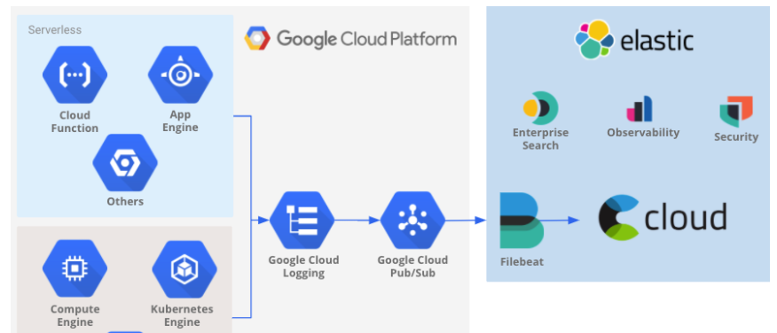

- ### Set up a Pub/Sub topic and subscriiption.


- ### Turn on audit logging for all services.

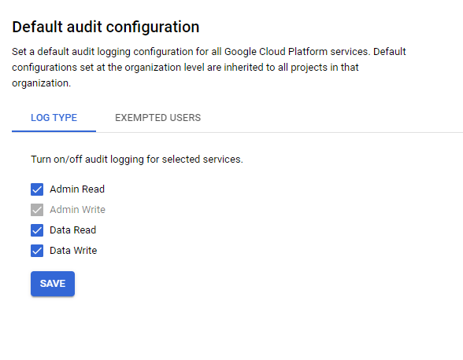

- ### Create a Sink service. Use this filter below.

```
logName="projects/tomcat-nginx-lb/logs/cloudaudit.googleapis.com%2Factivity" OR
"projects/tomcat-nginx-lb/logs/cloudaudit.googleapis.com%2Fdata_access" OR
"projects/tomcat-nginx-lb/logs/cloudaudit.googleapis.com%2Fsystem_event" OR
resource.type:"gce" OR resource.type="gcs_bucket" OR resource.type="bigquery_resource"
```

- ### Set IAM policy permissions for the Pub/Sub topic
Create Service account to the "es-logs-export" Pub/Sub topic with the Pub/Sub Publisher permissions, it grant the service account permission to publish to the topic.

- ### Check that the topic is receiving messages by using the Metrics Explorer in Cloud Monitoring.

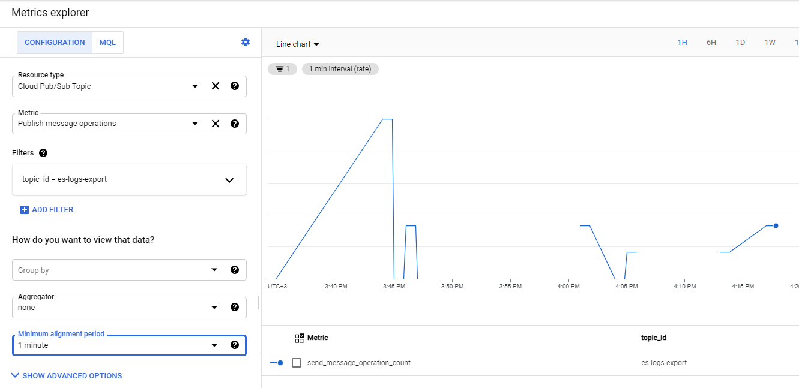


- ### Create Elastic Cloud Deployment for connect with Filebeat and monitor logs.

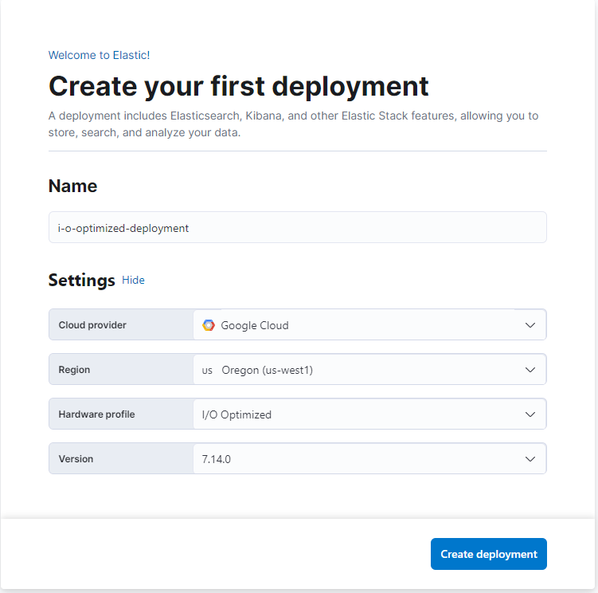

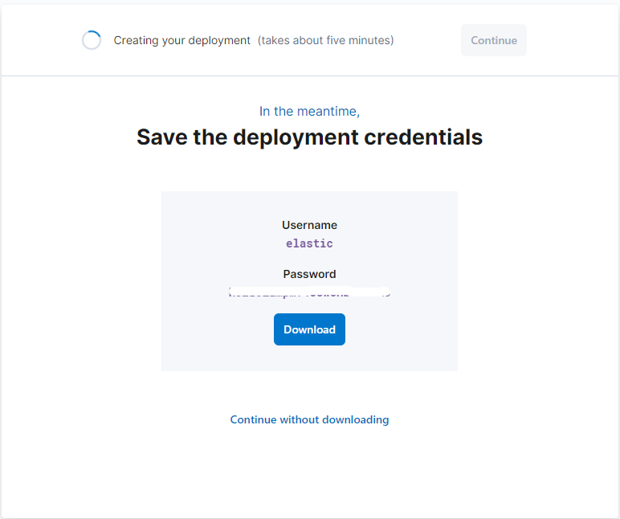

- ### Install and configure Filebeat on target host. Connect with elastic Cloud deployment.

```
# Install on CentOS
curl -L -O https://artifacts.elastic.co/downloads/beats/filebeat/filebeat-7.14.0-x86_64.rpm
sudo rpm -vi filebeat-7.14.0-x86_64.rpm

# Modify this string in /etc/filebeat/filebeat.yml to set the connection information for Elastic Cloud:
cloud.id: "i-o-optimized-deployment:<UID>"
cloud.auth: "elastic:<password>"

sudo filebeat modules enable system
sudo filebeat modules enable nginx

sudo filebeat setup
sudo service filebeat start
```

- ### Monitring Dashboard with system and nginx modules. 

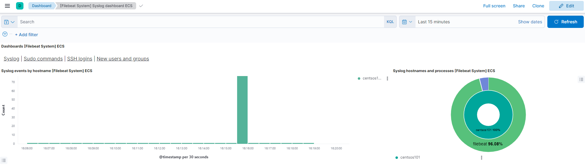

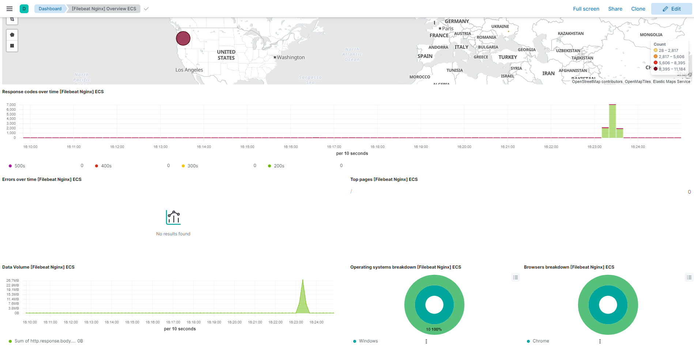

* ### References 

https://cloud.google.com/architecture/exporting-stackdriver-logging-elasticsearch

https://www.elastic.co/guide/en/cloud/current/ec-create-deployment.html


----------------------------------------------------


### 2. 
* ### Make startup script with installed and configured tomcat on CentOS image.

- startup script in startup-tomcat-centos.sh file

* ### Make instance template for tomcat on CentOS

```
gcloud beta compute --project=tomcat-nginx-lb instance-templates create instance-template-tomcat-centos-1 \
--machine-type=e2-medium \
--subnet=projects/tomcat-nginx-lb/regions/us-west1/subnetworks/backend-subnet \
--network-tier=PREMIUM \
--metadata=startup-script-url=gs://tomcat-bucket-centos/startup-tomcat-centos.sh \
--region=us-west1 \
--tags=allow-ssh,allow-http \
--image=centos-8-v20210721 \
--image-project=centos-cloud \
--boot-disk-size=20GB \
--boot-disk-type=pd-balanced
```

* ### Update MIG VM's 

- Update already working MIG instance-group-tomcat-1 with max oversize instance=1 and max unavailable instance=1.

```
gcloud compute instance-groups managed rolling-action start-update instance-group-tomcat-1 \
    --version=template=instance-template-tomcat-centos-1 \
    --max-surge=1 \
    --max-unavailable=1 \
    --zone=us-west1-b
```
* ### Previous version

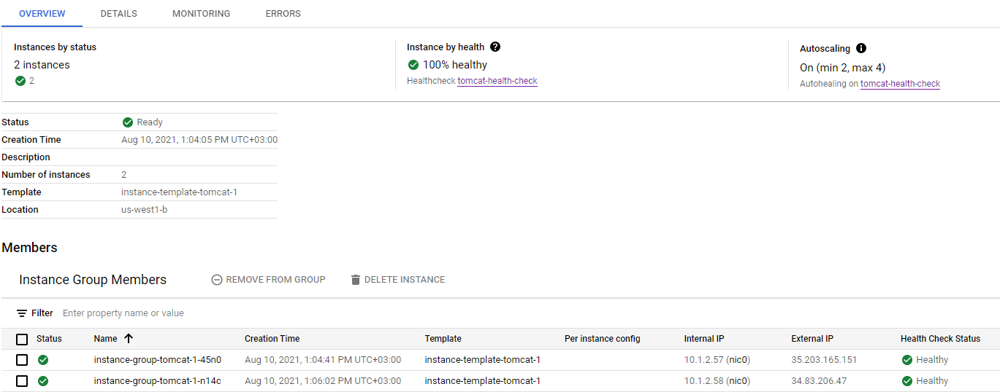

* ### Update 1

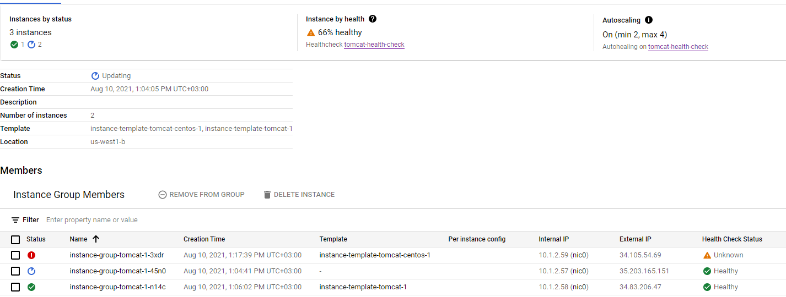

* ### Update 2

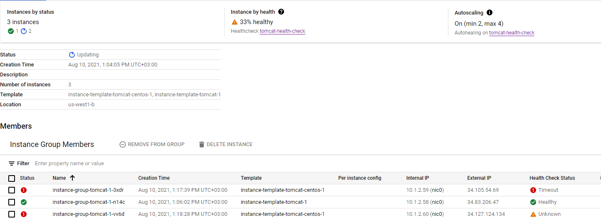

* ### Done 

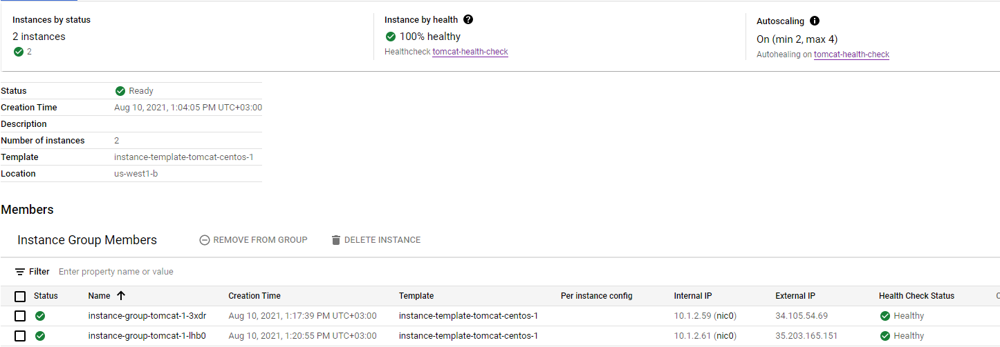

------------------------------------------

